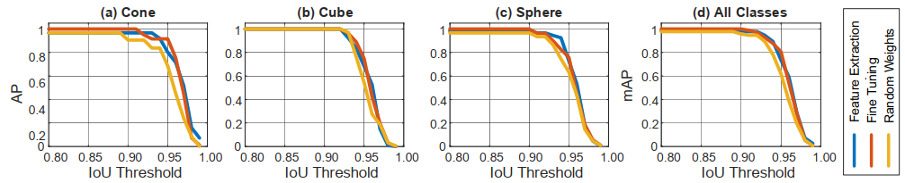

## Multiplanar Self-Calibration for Mobile Cobot 3D Object Manipulation using 2D Detectors and Depth Estimation

[Project Page]() | [Paper]() | [Video](https://www.youtube.com/watch?v=qoWWP7f93BM&ab_channel=AnonymousNonname)

## Author Information
- [Author 1]()
- [Author 2]()
- [Author 3]()

<div style="text-align:center">

</div>


## Abstract
Calibration is the first and crucial step in robotic applications to help robots manipulate objects precisely since errors caused by displacements often occur during the operating period and off-time period. In this paper, we present a novel method for self-calibration between the camera system and the robot's end-effector for three dimensions (3D) object manipulation. Our approach is to use a robot end-effector as ground truth to calibrate the camera's position and orientation in which the robot moves the model object in 3D known planes while a 2D state-of-the-art vision system detects the center of the object on the RGB camera's image plane. The transformation is then estimated from 2D pixels obtained by the detector and 3D known points obtained by robot kinematics. An integrated stereo-vision system then estimates the distance between the camera and the objects, resulting in 3D object localization. After executing self-calibration, our robot can localize objects in 3D using an RGB camera and depth image.  We tested our approach on a two-7-DOF-arm robot and a 2D detector that can run in real time on an onboard GPU. We also open our source at [https://github.com/anonymous20210107/calib_cobot](https://github.com/anonymous20210107/calib_cobot) for community reference and assessment.

## Experiments

<p align="center">

</p>

## Results
### Detector results
<p align="center">

</p>

### Calibration results
<p align="center">

</p>

## Installation

### Recommendation

- Ubuntu 20.04 or higher
- CUDA 11.1 or higher
- Python v3.7 or higher
- Pytorch v1.7 or higher
- Hardware Spec
    - GPUs 24GB (4090ti) or larger capacity

## Pre-trained Weights

You can find the pre-trained models for three strategies here.

### Pytorch models
- [Feature Transfer]()
- [Fined-tunning]()
- [Scratch]()
### Onnx models
- [Feature Transfer]()
- [Fined-tunning]()
- [Scratch]()

## Dataset
We train our custom models with our own in-lab dataset.
You can find it here [Dataset](https://github.com/anonymous20210107/calib_cobot/tree/main/yolov8_custom/3d_shapes)


## Yolov8
- Reference from [Yolov8]()
- Our custom code for calculating Precision over IoU [Yolov8_custom](https://github.com/anonymous20210107/calib_cobot/tree/main/yolov8_custom)

## Citing

```

```


## Acknowledgments
